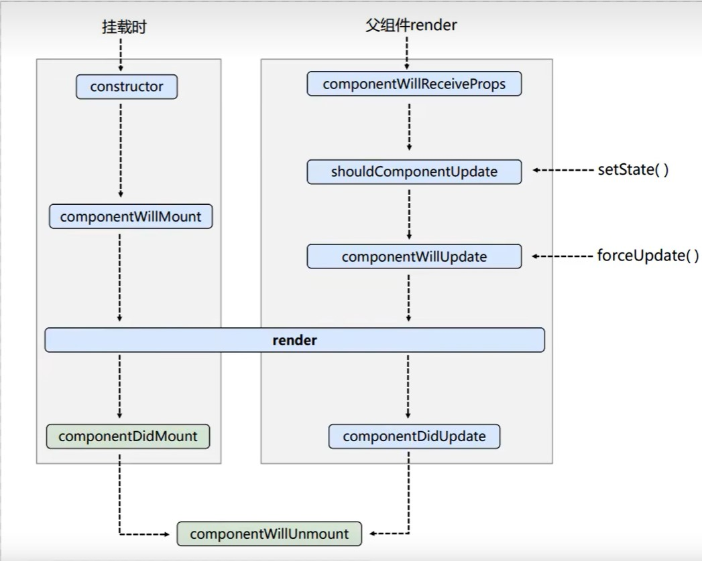
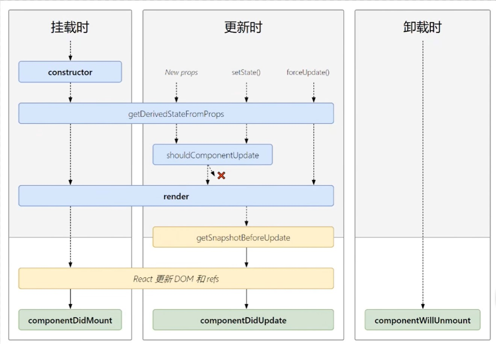

# 一、简介

1. 发送请求获取数据
2. 处理数据（过滤、整理格式等）
3. **操作 DOM 呈现页面**（这一步是 react 的主要目的）

所以说 react 是一个将数据渲染为 HTML 视图的开源 js 库

原生 js 特点：

1. 原生 js 操作 dom 繁琐，效率低
2. 使用 js 直接操作 dom，浏览器会进行大量的重绘重排
3. 原生 js 没有**组件化**编码方案，代码复用率低

react 特点：

1. 采用**组件化**模式，**声明式**编码，提高开发效率及组件复用率
2. 在 React Native 中可以使用 React 语法进行移动端开发
3. 使用**虚拟 dom**和优秀的**diffing 算法**，尽量减少与真实 dom 的交互

中文官网：`https://react.docschina.org`

# 二、入门

## 2.1 引入 react

```js
// jsx组件库，用于将jsx转为js
<script src="https://unpkg.com/babel-standalone@6/babel.min.js"></script>
// react核心库
<script src="https://unpkg.com/react@16/umd/react.development.js" crossorigin></script>
// react扩展库，用于支持react操作dom
<script src="https://unpkg.com/react-dom@16/umd/react-dom.development.js" crossorigin></script>
```

## 2.2 虚拟 DOM 和真实 DOM

创建一个虚拟 DOM：

```js
const VDOM = (
	<h1 id="title">
		<span>Hello,react</span>
	</h1>
);
```

1. **虚拟 DOM 的本质是 Object 类型的对象（一般对象）**
2. 虚拟 DOM 比较轻，真实 DOM 比较“重”，因为虚拟 DOM 是 React 内部在用，无需真实 DOM 上那么多的属性
3. 虚拟 DOM 最终会被转换为真实 DOM 并渲染在页面上

## 2.3 jsx 语法

全称：JavaScriptXML
XML 早期用于存储和传输数据

1. 定义虚拟 DOM 时，不要写引号
2. 标签混入 js**表达式**时要用{}
3. 样式的类名指定不要用 class，要用 className
4. 内联样式，要用`style={{key:value}}`的形式去写
5. 只能有一个根标签
6. 标签必须闭合
7. 标签首字母
   1. 若小写字母开头，则将该标签转为 html 中同名元素，若 html 中无该标签对应的同名元素，则报错
   2. 若大写字母开头，react 就去渲染对应的组件，若组件没有定义，则报错
8. 对于 jsx 中的每个元素，都需要产生一个**唯一对应**的 key

```js
const data = ["Angular", "React", "Vue"];
// 1.创建虚拟DOM
const vDom = (
	<div>
		<h1>前端js框架列表</h1>
		<ul>
			{data.map((item, index) => {
				return <li key={index}>{item}</li>;
			})}
		</ul>
	</div>
);
// 2.渲染页面
ReactDOM.render(vDom, document.getElementById("test"));
```

要注意区分 js 语句和 js 表达式

1. 表达式：一个表达式会产生一个值，可以放在任何一个需要值的地方
   1. a
   2. a+b
   3. demo(1)
   4. arr.map()
   5. function test()
2. 语句：控制代码语句，不会产生值
   1. if(){}
   2. for(){}
   3. switch(){case:}

## 2.4 组件与模块

### 2.4.1 模块

1. 模块就是向外提供特定功能的 js 程序，一般就是一个 js 文件
2. 为什么要拆成模块：随着业务逻辑的增加，代码越来越多且复杂
3. 作用：复用 js，简化 js 的编写，提高 js 的运行效率
4. 当应用的 js 都以模块化来编写的，这个应用就是一个模块化的应用

### 2.4.2 组件

1. 用来实现局部功能效果的代码和资源的集合（html/css/js/image 等等）
2. 通过组件化，可以复用编码，简化项目编码，提高运行效率

## 2.5 jsx 奇怪的注释方法

jsx 中写注释，平时没啥事儿，都是以`//`形式的，但是如果在一个有 html 结构的地方写注释就很奇怪了

```js
render() {
    return (
        <div>
        {/* 就必须以这种方式写注释。也就是在注释外面包一个{}*/ }
        </div>
    );
}
```

# 三、React 面向组件编程

## 3.1 函数式组件

```js
function Demo() {
	console.log(this); //此处的this是undefined，因为babel编译后开启了严格模式
	return <h2>Hello,React</h2>;
}
// 渲染组件到页面
ReactDOM.render(<Demo />, document.getElementById("test")); //这里的原理就是通过大写字母开头的标签去调用组件，之后在通过/来结束这个标签
```

## 3.2 类式组件

```js
// 1.创建类式组件,react中的类必须继承于react中内置的父类React.Component
//render中的this是MyComponent的实例对象 <=> MyComponent组件实例对象
class MyComponent extends React.Component {
	render() {
		console.log(this);
		return <h2>Hello,Class</h2>;
	}
}
// 2.渲染组件到页面
ReactDOM.render(<MyComponent />, document.getElementById("test"));
/*
 * 执行了ReactDOM.render(<MyComponent/>...之后，发生了什么？
 * 1.React解析组件标签，找到了MyComponent组件
 * 2.发现组件是用类定义的，随后new出来该类的实例，并通过该实例调用到原型上的render方法
 * 3.将render返回的虚拟DOM转为真实DOM，随后呈现在页面中
 *
 */
```

很奇怪，这里出现了个奇怪的 bug，还没法复现，属于是莫名其妙，找了好久也没找到为啥。。。

## 3.3 组件实例的三大核心

组件实例指的是类式组件，因为函数组件里都没有 this，没法玩实例。

### 3.3.1 state

```js
// 1.创建组件
class Weather extends React.Component {
	constructor(props) {
		super(props);
		// 2.初始化状态
		this.state = {
			isHot: false,
			wind: "微风",
		};
	}
	render() {
		// 3.读取状态
		return (
			// 这里其实是错的，因为changeWeather是作为onClick的回调，所以不是通过实例调用的，是直接调用
			// 而且类中的方法默认开启了局部的严格模式，所以changeWeather中的this是undefined
			<h1 onClick={this.changeWeather}>
				今天天气很{this.state.isHot ? "炎热" : "凉爽"}
			</h1>
		);
	}
	changeWeather() {
		console.log(this); // undefined
	}
}
// 4.渲染
ReactDOM.render(<Weather />, document.getElementById("test"));
```

state 的是以 key 和 value 成键值存在的。和 python 中的字典类似。其主要目的就是储存一些自定义的变量值，以便以后进行调用或修改。

其中存在 this 的调用问题，因为在 class 类里会自动设置**严格模式**，所以说，如果在外部调用 this 会显示 undefined。
就算在类里**直接调用**，也会显示 undefined。只有通过**实例调用**，才能正确的调用。

```js
class Weather extends React.Component {
	// 构造器只调用1次
	constructor(props) {
		super(props);
		this.state = { isHot: false };
		this.demo = this.test.bind(this);
	}
	// render调用1+n次，1是初始化的那次，n是状态更新的次数
	render() {
		return (
			<h1 onClick={this.demo}>
				今天天气很{this.state.isHot ? "炎热" : "凉爽"}
			</h1>
		);
	}
	// 点几次，调用几次
	test() {
		const isHot = this.state.isHot;
		// 状态必须通过setState进行改变，并且这种状态改变是合并不是替换
		this.setState({ isHot: !isHot });
	}
}
```

上面是正确的写法，为了好理解，我改变了函数的名称。test 函数会将其自身传递到原型链上，所以说`this.test`可以通过去寻找原型链找到 test 函数，但因为其是直接调用，所以说这时候的 this 还是 undefined。但是其通过`bind()`函数，将其转换成了一个新的函数，并且赋予了其一个新的 this，所以说这个时候`this.test.bind()`变成了一个拥有类的 this 的函数，所以说这时候通过赋值语句给`this.demo`,这时候就把 this 成功的传递了。

**状态必须通过`setState()`进行改变，并且这种状态改变是合并不是替换**

#### 3.3.1.1 简写方式

类中可以直接写赋值语句，所以可以将 state 直接写到类里进行赋值

```js
class Weather extends React.Component {
	state = { isHot: false, wind: "微风" };
	render() {
		// 这里通过定义一个对象就能够在下面直接进行调用了
		const { isHot, wind } = this.state;
		return (
			<h1 onClick={this.changeWeather}>
				今天天气很{isHot ? "炎热" : "凉爽"},{wind}
			</h1>
		);
	}
	// 自定义方法
	// 通过赋值语句和箭头函数来实现寻找this
	changeWeather = () => {
		// 这里也是同理
		const isHot = this.state.isHot;
		this.setState({ isHot: !isHot });
	};
}
```

组件中 render 方法中的 this 为组件实例对象
组建中自定义方法的 this 为 undefined，必须通过**bind 方法**或者**箭头函数**来寻找 this。

### 3.3.2 props

#### 3.3.2.1 ...运算符的用法

```js
let arr1 = [1, 3, 5, 7, 9];
let arr2 = [2, 4, 6, 8, 10];
// 1. 将一个数组展开
console.log(...arr1); //1,3,5,7,9
// 2. 合并两个数组
console.log(...arr1, ...arr2); //1,3,5,7,9,2,4,6,8,10

// 3. 运用在函数中，传递一系列参数
function sum(...numbers) {
	return numbers.reduce((preValue, currentValue) => {
		return currentValue + preValue;
	});
}

let person = { name: jack, age: 20 };
// 4. 值的复制
let person2 = { ...person }; // {name:jack, age:20}
// 5. 值的复制和修改
let person3 = { ...person, name: "tom" }; // {name:tom, age:20}
```

#### 3.3.2.2 props 解析

```js
class Person extends React.Component {
	render() {
		const { name, age, sex } = this.props;
		return (
			<ul>
				<li>姓名：{name}</li>
				<li>性别：{age}</li>
				<li>年龄：{sex}</li>
			</ul>
		);
	}
}
// 对标签属性进行类型、必要性的限制
Person.propTypes = {
	name: PropTypes.string.isRequired, //限制传递类型为string，必须传递
	sex: PropTypes.string,
	age: PropTypes.number,
	speak: PropTypes.func, //限制传递类型为函数
};
// 对标签默认值进行限制
Person.defaultProps = {
	sex: "男",
	age: 222,
};
// 可以对输入数据进行赋值类型的传递
const p = { name: "wh", age: 18, sex: "man" };
// 在渲染时，可以通过{...p}这种类型来进行值的传递
ReactDOM.render(<Person {...p} />, document.getElementById("test"));
// 或者说可以通过在标签中内置属性来进行数据的传递
// 但其实这两种处理方式的本质是相同的，都是在标签里输入数据来传递
ReactDOM.render(
	<Person name="whh" sex="man" />,
	document.getElementById("test1")
); //因为没传入age，所以会有一个默认age
// 因为age是一个数字类型，不能够使用''进行传入，只能够通过{}来传入
ReactDOM.render(
	<Person name="haha" age={16} />,
	document.getElementById("test2")
); //因为没有sex，会传入一个默认sex。
```

需要注意的是，为了添加限制性语句，也就是`propTypes`类型的语句，必须添加下面的 script 标签。因为自从 react15 以来，就把这部分内容移出去了。
需要单独进行调用。
`<script src="https://unpkg.com/prop-types@15.6/prop-types.js"></script>`

需要注意的是：props 是**只读**的，不能**直接进行修改**

#### 3.3.2.3 props 简写

```js
class Person extends React.Component {
	render() {
		const { name, age, sex } = this.props;
		return (
			<ul>
				<li>姓名：{name}</li>
				<li>性别：{age}</li>
				<li>年龄：{sex}</li>
			</ul>
		);
	}

	static propTypes = {
		name: PropTypes.string.isRequired, //限制传递类型为string，必须传递
		sex: PropTypes.string,
		age: PropTypes.number,
		speak: PropTypes.func, //限制传递类型为函数
	};

	static defaultProps = {
		sex: "男",
		age: 222,
	};
}
```

props 的简写核心就是将`propTypes`和`defaultProps`置入类内部，通过给其添加一个 **静态属性** `static`从而实现

#### 3.3.2.4 构造器与 props

在 react 中，**一般情况下 constructor 都可以进行省略**。
只有两种情况需要使用构造器：

1. 通过给`this.state`赋值对象来初始化内部`state`。
2. 为事件处理函数绑定实例

但是初始化内部 state 可以通过在类中直接`state={}`来进行
而自定义事件处理函数可以通过`demo = () =>{}`这种箭头函数的形式来实现

但是如果使用构造器，一定不能省略`super()`
但是几乎用不到这种情况，可能会出现未定义的 bug。

```js
constructor(props){
    // 构造器是否接收props，是否传递给super，取决于：是否希望在构造器中通过this访问props
    super(props);
}
```

**所以说，开发过程中最好别写构造器**

#### 3.3.2.5 函数式组件使用 props

```js
function Person(props) {
	const { name, age, sex } = props;
	return (
		<ul>
			<li>姓名：{name}</li>
			<li>年龄：{age}</li>
			<li>性别：{sex}</li>
		</ul>
	);
}

ReactDOM.render(
	<Person name="wh" age={18} sex="male" />,
	document.getElementById("test")
);
```

因为函数能够传递参数，所以说能够使用 props，但是不能使用 state

### 3.3.3 refs

#### 3.3.3.1 字符串形式的 ref

```js
class Demo extends React.Component {
	render() {
		return (
			<div>
				<input type="text" placeholder="点击按钮提示数据" ref="input1" />
				<button onClick={this.showData} ref="button">
					{" "}
					点击按钮显示数据
				</button>
				<input
					type="text"
					placeholder="失去焦点显示数据"
					ref="input2"
					onBlur={this.showData2}
				/>
			</div>
		);
	}
	// 展示左侧输入框的数据
	showData = () => {
		// console.log(this.refs.input1);
		const { input1 } = this.refs;
		alert(input1.value);
	};
	//展示右侧输入框的数据
	showData2 = () => {
		const { input2 } = this.refs;
		alert(input2.value);
	};
}
```

组件内的标签可以定义 ref 属性来标识自己，和 id 类似
ref 的形式也是以 key,value 形式来进行的。
key 为 ref 的名字，value 为具体的某个标签
`<input type="text" placeholder='点击按钮提示数据' ref='input1'/>`

**string 类型的 ref 已经过时了**，可能未来会被移除掉。
其存在一些效率上的问题。具体情况可以在 github 讨论区中看。

#### 3.3.3.2 回调形式的 ref

```js
class Demo extends React.Component {
	render() {
		return (
			<div>
				<input type="text" ref={(currentNode) => (this.input1 = currentNode)} />
				<button onClick={this.showInfo}>点击提示数据</button>
			</div>
		);
	}

	showInfo = () => {
		const { input1 } = this;
		alert(input1.value);
	};
}
```

通过回调函数的形式也可以定义 ref。`<input type="text" ref = {currentNode => this.input1 = currentNode}/>`
但是如果 ref 回调函数是以**内联函数**的方式定义的，在**更新过程中**它会被执行两次，第一次传入参数 null，然后第二次会传入参数 DOM 元素。
但如果是不会更新的元素是没有影响的。因为 render 的执行次数是 1+n 次，第一次是没有影响的。只有第二次开始为更新，会产生影响。
内联函数类似于：`<input ref = {(c) => {this.input = c; console.log(c);}}/>`
**通过将 ref 的回调函数定义成 class 的绑定函数的方式可以避免上述问题**

```js
render() {
    return (
        <input type="text" ref = {this.saveInput}/>
    );
}
saveInput(c){
    this.input1 = c;
}
```

#### 3.3.3.3 createRef

```js
class Demo extends React.Component {
	// React.createRef 调用后可以返回一个容器，该容器可以储存被ref所标识的节点
	// 该容器是专人专用的
	// 所以说每一次使用都得创建一个新的容器，好麻烦啊
	myRef = React.createRef();
	myRef2 = React.createRef();

	render() {
		return (
			<div>
				<input type="text" placeholder="HELLO" ref={this.myRef} />

				<button ref={this.myRef2} onClick={this.showData}>
					点击获取
				</button>
			</div>
		);
	}

	showData = () => {
		alert(this.myRef.current.value);
	};
}
```

`React.createRef`每次只能存储一个节点，也就是说每一个标签想使用都需要创建一个单独的容器。

**ref 有一个很重要的点，就是不要过渡使用 ref**

#### 3.3.3.4 react 的事件处理

1. 通过 onXxx 属性指定事件处理函数（注意大小写）
   1. React 使用的是自定义(合成)事件，而不是使用的原生 DOM 事件 ————为了更好的兼容性
   2. React 中的事件是通过事件委托方式处理的(委托给组件最外层的元素) ————为了更高效
2. 通过`event.target`得到发生事件的 DOM 元素对象 ———— 通过这种方式可以有效的减少 ref 的使用
   1. 当需要处理的事件和需要添加的 ref 位于相同标签内时，可以省略 ref，通过`event.target`来在事件内寻找所需的属性

## 3.5 收集表单数据

### 3.5.1 受控组件

页面中随着输入，不断更新和维护状态，就叫做受控组件。

```js
class Login extends React.Component {
	// 初始化状态
	state = {
		username: "",
		password: "",
	};
	//储存用户名，将用户名维护到state中
	saveUsername = (event) => {
		console.log(event.target.value);
		this.setState({ username: event.target.value });
	};
	// 储存密码，将密码维护到state中
	savePassword = (event) => {
		console.log(event.target.value);
		this.setState({ password: event.target.value });
	};
	// 提交请求,通过维护的状态来选取
	handleSubmit = (event) => {
		event.preventDefault();
		const { username, password } = this.state;
		alert(`用户名为：${username}，密码为：${password}`);
	};

	render() {
		return (
			<form action="https://whcoding.cc" onSubmit={this.handleSubmit}>
				用户名：
				<input type="text" name="username" onChange={this.saveUsername} />
				密码：
				<input type="password" name="password" onChange={this.savePassword} />
				<button>登录</button>
			</form>
		);
	}
}
```

受控组件比非受控组件更优秀一点,因为受控组件不使用 ref,所以应该尽量使用受控组件来进行开发

### 3.5.2 非受控组件

页面中所有现用现取的组件就叫做非受控组件

```js
class Login extends React.Component {
	handleSubmit = (event) => {
		event.preventDefault(); //阻止默认事件
		const { inputUser, inputPass } = this;
		alert(
			`您输入的用户名是：${inputUser.current.value}，您输入的密码是：${inputPass.current.value}`
		);
	};

	inputUser = React.createRef();
	inputPass = React.createRef();
	render() {
		return (
			<form action="https://whcoding.cc" onSubmit={this.handleSubmit}>
				用户名：
				<input ref={this.inputUser} type="text" name="username" />
				密码：
				<input ref={this.inputPass} type="password" name="password" />
				<button>登录</button>
			</form>
		);
	}
}
```

## 3.6 高阶函数、函数柯里化

高阶函数：如果一个函数符合下面两个规范中的任何一个，那该函数就是高阶函数：

1. 若 A 函数，接收的参数时一个函数，那么 A 就可以称之为高阶函数
2. 若 A 函数，调用的返回值依然是一个函数，那么 A 就可以称之为高阶函数

常见的高阶函数有：Promise、setTimeout、数组的一些方法，比如 arr.map()等等

**函数的柯里化**：
通过函数调用继续返回函数的方式，实现多次接收参数最后统一处理的函数编码形式

```js
saveFormData = (dataType) => {
    return (event)=>{
        this.setState({[dataType]:event.target.value});
    }
}

render() {
    return (
        <form action="https://whcoding.cc" onSubmit={this.handleSubmit}>
        用户名：
        {/*onChange的回调应该是一个函数*/}
		<input type="text" name="username" onChange={this.saveFormData('username')} />
		密码：
		<input
		type="password"
		name="password"
		onChange={this.saveFormData('password')}
		/>
		<button>登录</button>
		</form>
		);
}
```

这里的 saveFormData 就运用了柯里化的概念，其首先回传了一个参数叫 dataType，也正是通过这个参数来实现了不同的数据需求。
之后在 return 中又返回了 event，通过 event 来寻找 value。所以说是多次接收参数最后统一处理。

## 3.7 组件的生命周期

```js
class Life extends React.Component {
	state = { opacity: 1 };

	death = () => {
		// 因为组件挂载之后，定时器一直存在，如果不在卸载组件时把定时器清除掉的话，那么就会导致把组件卸载后，定时器仍然存在，从而倒置bug
		// 清除定时器
		// clearInterval(this.timer);
		// 卸载组件
		ReactDOM.unmountComponentAtNode(document.getElementById("life"));
	};

	// 组件挂载之后，只执行一次
	componentDidMount() {
		this.timer = setInterval(() => {
			let { opacity } = this.state;
			opacity -= 0.1;
			if (opacity <= 0) opacity = 1;
			this.setState({ opacity });
		}, 200);
	}

	// 组件将要卸载
	componentWillUnmount() {
		// 在这里清除定时器也行
		clearInterval(this.timer);
	}

	// render调用的时机：初始化渲染，状态更新之后
	render() {
		return (
			<div>
				<h1 style={{ opacity: this.state.opacity }}>React学不会怎么办？</h1>
				<button onClick={this.death}>不活了</button>
			</div>
		);
	}
}
```

挂载(mount),就是页面进行渲染的时候，也就是把组件挂载到了页面上。
卸载(unmount)，就是将组件从页面上移除，就是卸载。

### 3.7.1 组件挂载流程

1. 组件从创建到死亡它会经历一些特定的阶段
2. React 组件中包含一系列钩子函数(生命周期回调函数)，会在特定的时刻调用
3. 我们在定义组件时，会在特定的生命周期回调函数中，做特定的工作

#### 3.7.1.1 react 生命周期(旧)



```js
class Count extends React.Component {
	// 构造器
	constructor(props) {
		console.log("count=constructor");
		super(props);

		// 初始化状态
		this.state = { count: 0 };
	}

	// 组件将要挂载的钩子
	componentWillMount() {
		console.log("Count-componentWillMount");
	}

	// 组件挂载完毕的钩子
	componentDidMount() {
		console.log("count-componentDidMount");
	}

	// 组件将要卸载的钩子
	componentWillUnmount() {
		console.log("count-componentWillUnmount");
	}

	// 控制state更新的钩子
	shouldComponentUpdate() {
		console.log("count-shouldComponentUpdate");
		return true;
	}

	// 组件将要更新的钩子
	componentWillUpdate() {
		console.log("count-componentWillUpdate");
	}
	// 组件完成更新的钩子
	componentDidUpdate() {
		console.log("count-componentDidUpdate");
	}

	// 回调按钮
	add = (event) => {
		const { count } = this.state;
		this.setState({ count: count + 1 });
	};

	death = () => {
		ReactDOM.unmountComponentAtNode(document.getElementById("test"));
	};

    // 强制更新
    force = () => {
        this.forceUpdate();
    }

	render() {
		const { count } = this.state;
		console.log("render");
		return (
			<div>
				<h2>当前求和为{count}</h2>
				<button onClick={this.add}>点我+1</button>
				<button onClick={this.death}>点我消失</button>
				<button onClick={this.force}>强制更新</button>
			</div>
		);
	}
}
```

所以说，当组件加载时，顺序为`constructor ---> componentWillMount ---> render ---> componentDidMount`

当组件将要卸载时，首先通过`componentWillUnmount`，之后再进行卸载操作

`shouldComponentUpdate`是关于控制状态更新的重要钩子，如果不写的话，默认会返回 true，但如果它返回了 false，则不会执行下面的操作。
也就是不会执行后面的`setState`、`render`等操作。组件就会就此闭合

所以说，组件的更新周期的顺序为`shouldComponentUpdate ---> componentWillUpdate ---> render --> componentDidUpdate`
因为第一次不会调用`componentWillReceiveProps`,只有第二次更新才会调用这个钩子，这是个坑-。-

强制更新`forceUpdate()`，可以跳过`shouldComponentUpdate`，直接从`componentWillUpdate`开始。

```js
        // 父组件
        class A extends React.Component {
            state = {carName: '奔驰'};

            changeCar = () => {
                this.setState({carName: '奥拓'});
            }
            render() {
                return (
                    <div>
                        <div>我是A组件</div>
                        <button onClick={this.changeCar}>换车</button>
                        {/*通过在A中引用B让其作为子组件*/ }
                        <B carName={this.state.carName}/>
                    </div>
                );
            }
        }

        // 子组件
        class B extends React.Component {
            // 这里有个坑，就是第一次调用的时候，不会调用这个钩子
            // 只有再第二次开始调用，也就是接收新的props的钩子，才会调用这个钩子
            componentWillReceiveProps(props){
                console.log('componentWillReceiveProps',props);
            }
            render() {
                return (
                    <div>我是B组件，接收到的车是：{this.props.carName}</div>
                );
            }
        }
```

#### 3.7.1.2 react生命周期（新）
React17开始更新的了新的生命周期钩子函数，对旧版的钩子函数进行了一些改动，并且加入了一些新的钩子函数。

**新生命周期废弃了3个旧钩子，并添加了2个新钩子**


**废弃改动：**

`componentWillMount`、`componentWillReceiveProps`、`componentWillUpdate`这三个钩子被重命名了。
也就是所有带will的钩子都被改动了。除了卸载的那个钩子
而且在18版本，必须通过`UNSAFE_component...`才能够使用了。
属于是提前打预防针-。-

**新增改动：**

`getDerivedStateFromProps`首先是一个静态方法，其在使用前必须添加`static`。并且其需要返回一个`state obj`或者是`null`
此方法适用于罕见的用例，**即state的值在任何时候都取决于props**。

派生状态会导致代码冗余，难以维护。

`getSnapshotBeforeUpdate(prevProps, prevState)`其执行顺序位于`render`和`componentDidUpdate`之间。
其必须返回一个`snapshot value`或者是`null`。
`snapshot value`可以是任何值，无论是number、string或者什么东西。

其在最近一次渲染输出（提交到DOM节点）之前调用。它使得组件能在发生更改之前从DOM获取一些信息（例如：滚动位置）。
此生命周期的任何返回值将作为参数传递给`componentDidUpdate()`。

这个钩子函数也不常见，但它可能出现在UI处理中。
```js
// 这个例子就是不断的创建一个新闻，但是通过钩子函数去固定页面，让其保持在一个高度。
        class NewsList extends React.Component{
            state = {newsArr:[]};

            componentDidMount() {
                setInterval(() => {
                    // 获取原状态
                    const {newsArr} = this.state;
                    // 模拟一条新闻
                    const news = '新闻' + (newsArr.length+1);
                    // 更新状态
                    this.setState({newsArr: [news,...newsArr]});
                }, 1000)
            }

            getSnapshotBeforeUpdate(){
                // 这里返回的是变化前的值
                return this.refs.list.scrollHeight;
            }

            componentDidUpdate(prevProps, prevState,height) {
                // 这里的右边前面的数是变化后的值，其和变化前的值的固定差值为一个新闻的高度。
                // 所以可以通过不断的加去保证其固定高度。
                this.refs.list.scrollTop += this.refs.list.scrollHeight - height;
            }
            render() {
                return (
                    <div className='list'>
                        {
                            this.state.newsArr.map((n,index) => {
                                return <div className='news' key={index}>{n}</div>;
                            })
                        }
                    </div>
                );
            }
        }
```
