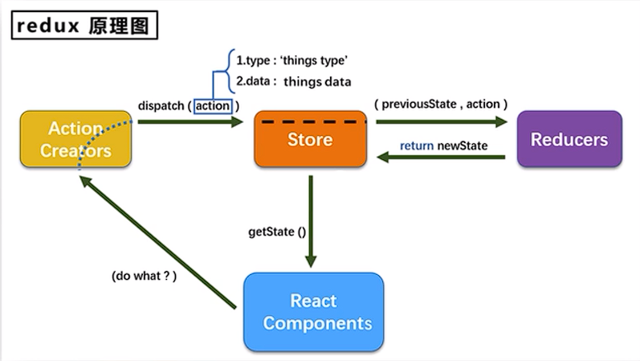

# 一、使用 create-react-app 创建 react 应用

## 1.1 react 脚手架

1. 脚手架就是用来帮助快速创建一个基于 xxx 库的模板项目
   1. 包含所有需要的配置(语法检查，jsx 编译，devServer...)
   2. 下载好了所有相关的依赖
   3. 可以直接运行一个简单效果
2. react 提供了一个用于创建 react 项目的脚手架库:create-react-app
3. 项目的整体技术架构为：react+webpack+es6+eslint
4. 使用脚手架开发的项目的特点：模块化，组件化，工程化

## 1.2 配置

比较古老的方式：`npm install -g create-react-app`
但是这种方式可能会出现一些小 bug，比如说显示：

```js
mayankthakur@Mayanks-MacBook-Air ~ % npm install -g create-react-app

npm WARN deprecated tar@2.2.2: This version of tar is no longer supported, and will not receive security updates. Please upgrade asap.

changed 67 packages, and audited 68 packages in 1s

4 packages are looking for funding
  run `npm fund` for details

3 high severity vulnerabilities

To address all issues, run:
  npm audit fix

Run `npm audit` for details.
```

但是这不是 error，是一个 warning。就是告诉你的 tar 版本太低咧。但是没啥事儿。我试着更新了一下 tar 的版本，但是好像没啥用。
之后再创建项目`create-react-app react-staging`类似于这样就行了。

或者说，可以使用新的方法：
`npx create-react-app my-app`
**这条命令会临时安装 create-react-app 包，命令完成后 create-react-app 会删掉，不会出现在 global 中。下次再执行，还是会重新临时安装。**

之后在安装完成后，进入已经创建好的项目目录，`npm start`启动项目。

## 1.3 内容

1. node_modules 存放脚手架所需的依赖
2. public 存放静态资源文件。包括 favicon.ico 的网页图标，index.html 为 react 提供节点。

以下是 index.html 文件中自带的一些设置
`<link rel="icon" href="%PUBLIC_URL%/favicon.ico"/>`这里的这个路径`%PUBLIC_URL%`表示的是 public 这个文件夹的路径
`<meta name="theme-color" content="#000000" />`用于配置浏览器页签+地址栏的颜色（仅安卓手机浏览器），兼容性不好，不常用

```html
<meta name="description" content="Web site created using create-react-app" />
```

上面这个标签为网页提供一个描述，告诉浏览者们网页的用处
`<link rel="apple-touch-icon" href="%PUBLIC_URL%/logo192.png" />`这个的作用比较奇怪，就是在 ios 端，当你想要将一个网页放到主屏幕时，会显示这个图片。也就是在主屏幕上显示的，类似于 app 图标的图片。
可以在网页外面加壳，从而将一个网页变成一个 apk 文件。`<link rel="manifest" href="%PUBLIC_URL%/manifest.json" />`这个 json 文件决定了网页加壳时的一些设置。
`<noscript>You need to enable JavaScript to run this app.</noscript>`若浏览器不支持 js，则显示标签内的内容
`robots.txt`决定了爬虫的规则，是爬虫规则文件

3. src 文件夹中：
   1. app.js 和 app.css 组成了一个 app 组件。因为在 public 文件夹里的 index.html 中有一个`<div id='root'></div>`，这个就是虚拟 dom 需要渲染的节点，而 app 组件就是渲染到这个这个节点上的唯一组件。其他组件需要当作 app 的子组件。
   2. app.test.js 用做测试 app 组件
   3. index.js 是入口文件。这里引入了 app 组件，并在页面上进行渲染。index.css 是他的样式文件。
   4. `<React.StrictMode> <App /> </React.StrictMode>`这个的目的是检查 App 组件，会提醒一些写的不合理的东西
   5. reportWebVital.js 是做页面性能检测的
   6. setupTests.js 是做组件检测的
4. 主要编写的内容就是 public/index.html 和 src/App.js 和 src/index.js

# 二、脚手架学习

## 2.1 基本内容的编写

首先是`public/index,html`，因为这部分只负责引入一个用于渲染的节点。所以内容比较简单。

```html
<!DOCTYPE html>
<html lang="en">
	<head>
		<meta charset="UTF-8" />
		<meta http-equiv="X-UA-Compatible" content="IE=edge" />
		<meta name="viewport" content="width=device-width, initial-scale=1.0" />
		<title>Hello-React</title>
	</head>
	<body>
		<div id="root"></div>
	</body>
</html>
```

其次是`src/App.js`，这部分是组件的主要内容,也是组件最后汇总的地方

```js
// 创建“外壳”组件
import React, { Component } from "react";
// 引用，但是js后缀可以省略
import Hello from "./components/Hello/Hello.js";
// 省略型引用
import Welcome from "./components/Welcome";

// 创建并暴露App组件
export default class App extends Component {
	render() {
		return (
			<div>
				<Hello />
				<Welcome />
			</div>
		);
	}
}
```

通过引入两个子组件来完成组件的设置。子组件的引用有两种方式，一种是通过直接引用。另一种是如果文件夹中的 js/jsx 文件命名为 index.js，则可以省略。
并通过暴露这个 App 组件使得能被 index.js 调用
`src/index.js`主要负责的就是渲染组件到页面上。

```js
// 引入库
import React from "react";
import ReactDOM from "react-dom";
import App from "./App";

// 渲染
ReactDOM.render(<App />, document.getElementById("root"));
```

子组件以`Hello.js`为例：

```js
import React, { Component } from "react";
import "./Hello.css";
export default class Hello extends Component {
	render() {
		return <h2 className="title">Hello,react!</h2>;
	}
}
```

### 2.1.1 React18 的一些新特性

`ReactDOM.render`在 React18 中被废弃了，取而代之的是`createRoot render`
现在需要首先提取出这个节点，在这个节点上使用 createRoot 方法，之后在将其渲染。

```js
// 渲染
const container = document.getElementById("root");
// Create a root.
const root = ReactDOM.createRoot(container);
// Initial render: Render an element to the root.
root.render(<App />);
```

并且需要注意的是：`import ReactDOM from 'react-dom/client'`引用改成了这种形式。

## 2.2 样式的模块化

```js
import React, { Component } from "react";
import hello from "./Hello.module.css";
export default class Hello extends Component {
	render() {
		return <h2 className={hello.title}>Hello,react!</h2>;
	}
}
```

通过给 css 文件命名为`xxx.module.css`来将样式文件进行模块化。之后就能在 js 文件中进行 import 调用了。
在下面的样式引用时，可以通过调用`className={hello.title}`这种类型来进行样式的调用。

## 2.3 vscode 中的 React 插件

`ES7+ React/Redux/React-Native snippets`
提供 rcc/rfc/等快捷键
`React Native Tools`
提供 ren 等快捷键 0
`React Style Helper`

比较推荐这三个插件。-.-

## 2.5 组件化编码流程

1. 拆分组件：拆分界面，抽取组件
2. 实现静态组件：使用组件实现静态页面效果
3. 实现动态组件
   1. 动态显示初始化数据
      1. 数据类型
      2. 数据名称
      3. 保存在哪个组件
   2. 交互（从绑定事件监听开始）

# 三、react ajax

1. React 本身只关注于界面，并不发送 ajax 请求的代码
2. 前端应用需要通过 ajax 请求与后台进行交互（json 数据）
3. react 应用需要集成第三方 ajax 库或自己封装
4. 不建议使用 ajax。建议使用**axios**，可以在浏览器端和 node 服务器端

## 3.1 axios

为了使用 axios，应该使用 yarn 或者 npm 添加 axios
`yarn add axios`或者是`npm install axios`
ajax 引擎因为有同源策略，所以说不好使用跨域请求。
如果想要给其他端口发送请求，需要开启一个**中间服务器**，比如浏览器端口为 3000，需要请求的端口是 5000。就可以通过一个开在 3000 端口的中间服务器，而这个中间服务器是没有 ajax 引擎的。所以说不存在同源策略。首先浏览器发送请求到中间服务器，中间服务器转交到 5000 端口的后端服务器。之后再返回到 3000 的中间服务器。因为两个服务器的端口都是 3000，所以不会产生跨域请求，这时候就能把请求传回来咧。这样就完成了一次请求。

第一种方式：

1. 在`package.json`中添加`"proxy":"http://localhost:5000"`，意思就是向 5000 端口进行代理。但是这种代理是有局限性的
2. `axios.get('http://localhost:3000/students')`在 axios 端向 3000 端口发送请求，如果在 3000 端口没有这个文件，则会向 5000 端口进行转发
3. 这种方式的局限性就是如果本来的端口就存在这个文件，则会首先请求本身端口的文件，而不是请求服务器端的文件。只有本身没有这个文件，才会向服务器端请求。

说明：

1. 优点：配置简单，前端请求资源时可以不加任何前缀。
2. 缺点：不能配置多个代理。
3. 工作方式：上述方式配置代理，当请求了 3000 不存在的资源时，那么该请求会转发给 5000 （优先匹配前端资源）

第二种方式：
在 src 文件夹中新建`setupProxy.js`,创建代理配置文件

```js
const { createProxyMiddleware } = require("http-proxy-middleware");

module.exports = function (app) {
	app.use(
		createProxyMiddleware("/api1", {
			//api1是需要转发的请求(所有带有/api1前缀的请求都会转发给5000)
			target: "http://localhost:5000", //配置转发目标地址(能返回数据的服务器地址)
			changeOrigin: true, //控制服务器接收到的请求头中host字段的值
			/*
         	changeOrigin设置为true时，服务器收到的请求头中的host为：localhost:5000
         	changeOrigin设置为false时，服务器收到的请求头中的host为：localhost:3000
         	changeOrigin默认值为false，但我们一般将changeOrigin值设为true
         */
			pathRewrite: { "^/api1": "" }, //去除请求前缀，保证交给后台服务器的是正常请求地址(必须配置)
		}),
		createProxyMiddleware("/api2", {
			target: "http://localhost:5001",
			changeOrigin: true,
			pathRewrite: { "^/api2": "" },
		})
	);
};
```

说明：

1. 优点：可以配置多个代理，可以灵活的控制请求是否走代理。
2. 缺点：配置繁琐，前端请求资源时必须加前缀。

## 3.2 兄弟组件之间的数据通信

通过消息订阅——发布机制
通过工具库：PubSubJS 来实现
通过`yarn add pubsub-js`或`npm install pubsub-js`来添加这个库

```js
// 通过这个表达发布机制，也就是通过其发布信息
PubSub.publish("信息名", { key: value });

// 这个是订阅机制，也就是当在组件中接收到信息名，则会执行回调函数
PubSub.subscribe("信息名", (name, data) => {});
```

通过这两个就能够实现兄弟组件间的通信，比如在一个组件中进行信息的发布，之后在另一个组件中进行信息的订阅。
通过这样就能够简单的实现 state 的更新。

```js
// 比如说一个组件发布state的更新
PubSub.publish('data',{})

// 另一个组件在组件挂载时，进行订阅并进行状态的更新
componentDidMount(){
this.token = PubSub.subscribe('data',(_,stateObj)=>{
    this.setState(stateObj)
})
}

// 在被卸载时，将这个订阅取消掉
componentWillUnmount(){
    PubSub.unsubscribe(this.token)
}

```

所以通过这种方式，可以进行任意组件间的通信，不光局限于父子组件或兄弟组件。

## 3.3 fetch

特点：

1. 原生函数，和 xhr 是并列的。不使用xhr提交ajax请求
2. 老版本浏览器可能不支持

xhr 不符合关注分离的原则。
fetch 是符合 promise 的风格的。

```js
fetch(url).then(
    response =>{console.log('联系服务器成功了');
    return response.json()}
).then(
    response => {console.log('获取数据成功了',response);}
).catch(
    error => console.log('请求出错',error);
)
```

上面这个例子就是一个关注分离的例子，就是 fetch 请求可能能够连接服务器，但如果错误的调用，是不能够获取数据的。
要是连接服务器都失败，那么有可能是服务器离线。
最后通过 catch 来兜底，统一处理错误

或者可以使用`async`和`await`进行处理

```js
const xxx = async () => {
	try {
		const response = await fetch(url);
		const data = await response.json();
		console.log(data);
	} catch (error) {
		console.log("请求出错", error);
	}
};
```

# 四、React路由
## 4.1 相关理解
### 4.1.1 SPA
1. 单页web应用（single page web application，SPA）
2. 整个应用只有**一个完整的页面**
3. 点击页面中的链接**不会刷新**页面，只会做页面的**局部更新**
4. 数据都需要通过ajax请求获取，并在前端异步展现

### 4.1.2 路由(Route)
1. 什么是路由？
   1. 一个路由是一个映射关系(key:value)
   2. key为路径(path)，value可能是function或是component
2. 路由的种类：
   1. 后端路由：
      1. 理解：value为function，用来处理客户端提交的请求
      2. 注册路由：router.get(path,function(req,res))
      3. 工作过程：当node接收到一个请求时，根据请求路径找到匹配的路由，调用路由中的函数来处理请求，返回响应函数
   2. 前端路由：
      1. 浏览器端路由，value是component，用于展示页面内容
      2. 注册路由：`<Route path='/test component={Test}'>`
      3. 工作过程：当浏览器的path变为/test时，当前路由组件就会变成Test组件
3. 浏览器的历史记录是以栈的形式存在的，当浏览一条记录时，将这条记录压入栈中，当回退时，将当前记录出栈，则暴露了上一条记录。

## 4.2 history
1. 使用H5推出的history身上的api来操纵历史记录的前进和后退等
```js
let history = History.createBrowserHistory();

function push(path) {
	history.push(path);
}

function replace(path) {
	history.replace(path);
}

function back() {
	history.goBack();
}

function forward() {
	history.goForward();

}
```

2. 使用hash值(锚点)来操纵`let history = History.createHarshHistory()`

## 4.3 react-router
1. react的一个插件库
2. 专门用来实现一个SPA应用
3. 共分为三部分，分别给web、native、any使用
4. 前端使用的主要是react-router-dom
5. 下载：`npm i react-router-dom`
6. 引入css文件时要注意不要加`.`。应该使用`<link rel="stylesheet" href="/bootstrap.css">`或者用%形式写也行。负责会出现**样式丢失**的问题。
7. 与 React Router 5.x 版本的区别：
	- 内置组件的变化：移除`<Switch/>`，新增`<Routes/>`……
	- 语法变化：`component={About}`变成`element={<About/>}`……
	- 新增 hook：useParams、useNavigate、useMatch……
	- 官方明确表示推荐使用函数式组件
### 4.3.1 一级路由
首先下载并引入路由，在index.js中通过BrowserRouter/HashRouter对App组件进行包裹，这意味着进行了路由的包裹
但是HashRouter传递的path为`localhost:3000/#/....`，#后面的参数都不会给服务器传递。所以最好还是用`BrowserRouter`
```js
// 引入库
// 从 react-dom/client 引入 ReactDOM
import React from 'react'
import ReactDOM from 'react-dom/client'
import { BrowserRouter } from 'react-router-dom'
import App from './App'

// React 18 的语法发生改变了
ReactDOM.createRoot(document.getElementById('root')).render(
    <BrowserRouter>
        <App />
    </BrowserRouter>
)
```
之后在App.js中进行路由链接和注册路由
```js
import React from 'react'
import {NavLink,Routes,Route} from 'react-router-dom'
import Home from './components/Home'
import About from './components/About'

<div className="list-group">
    {/* 路由链接 */}
    <NavLink className="list-group-item" to="/about">About</NavLink>
    <NavLink className="list-group-item" to="/home">Home</NavLink>
</div>

{/* 注册路由 */}
<Routes>
    <Route path='/about' element={<About/>} />
    <Route path='/home' element={<Home/>} />
</Routes>
```
1. 路由链接：
	1. 原生html中，靠`<a>`来跳转不同的页面。在React中靠路由链接实现切换组件`<NavLink className="list-group-item" to="/about">About</NavLink>`
	2. 或者是`<Link className="list-group-item" to="/about">About</Link>`。
	3. 需要注意的是，to后面跟的路径不能带`.`
	4. NavLink默认会给链接添加一个active属性。或者可以添加一个属性`activeClassName = ''`从而对点击的链接添加一个独特的属性。
```js
	<BrowserRouter>
		<Link className="list-group-item" to="/about">About</Link>
	</BrowserRouter>
```
2. 注册路由：
   1. `<Routes>`用于对注册路由的组件进行包裹。当url变化时，`<Routes>`会查看所有子`<Route>`元素以找到最佳匹配并呈现组件
   2. 而`<Route>`组件的格式为固定的`<Route path='/about' element={<About/>} />`，其中path前面不要加`.`。因为可能会出现格式加载的问题。element里面是引用的组件。
   3. `<Routes>`和`<Route>`要配合使用，且必须用`<Routes>`包裹`<Route>`
   4. `<Route>`相当于一个if语句，如果其路径与当前url匹配，则呈现对应的组件
   5. `<Route caseSensitive>`属性用于指定匹配时是否区分大小写（默认为false）

3. 路由组件和一般组件的区别：
   1. 接收到的props不同：路由组件的props传递了三组固定的属性（history、location、match），一般组件的props为传递的东西
   2. 写法不同：路由组件需要通过路由器进行渲染(`<Route path='/home' element={<Home/>} />`)，一般组件是直接进行渲染(`<Demo/>`)
   3. 位置不同：一般组件位于components文件夹，路由组件位于pages文件夹

### 4.3.2 封装NavLink组件
```js
import React,{ Component } from 'react';
import {NavLink} from 'react-router-dom'

export default class MyNavLink extends Component {
	render() {
		return (
			<NavLink activeClassName='xxx' className='xx' {this.props}/>
		);
	}
}
```

这样将其封装成一个一般组件，之后调用NavLink时就可以简单的调用咧。`<MyNavLink to='xxx' />`

### 4.3.3 重定向
使用`<Navigate>`组件可以完成重定向，其只要被渲染，就会修改路径，切换视图。
其可以添加replace属性，默认为push。如果`replace={true}`则为replace模式
```js
import React from 'react'
import {Navigate} from'react-router-dom'

export default function Home() {
	const [sum,setSum ] = useState(1)
  return (
	<div>
		<h3>Home</h3>
		{sum ===1 ? <h4>sum的值为{sum}</h4> : <Navigate to = '/about' replace= {true}>}
		<button onClick={() => setSum(2)}>点我将sum变为2</button>
	</div>
  )
}
```

### 4.3.4 路由表
通过useRoutes使用路由表
首先在./src中建立一个routes文件夹用于存放路由规则。
```js
import React from 'react'
import About from '../pages/About'
import Home from '../pages/Home'
import {Navigate} from 'react-router-dom'


export default [
    {
        path: '/about',
        element: <About />
    },
    {
        path: '/home',
        element: <Home />
    },
    {
        path: '/',
        element: <Navigate to='/about' />
    },
]
```
在这个路由规则文件中调用组件和其他，并将路由规则通过数组形式暴露出去。
之后在App中引用这个文件，使用useRoutes来调用这些规则，之后在返回时，就可以方便的调用这些组件了。
```js
import {NavLink,useRoutes} from 'react-router-dom'
import routes from './routes'

export default function App() {
	const element = useRoutes(routes)
	return{
		{element}
	}
}
```

### 4.3.5 嵌套路由
嵌套路由中，需要使用`<Outlet>`设置子路由的路由出口，即在何处渲染子路由。
设置二级路由链接时，可以是 to="news"、to="./news"，但不能是 to="/news"。
不使用路由表的嵌套路由：
```js
// App.js
export default function App() {
  return (
    <div>
      <NavLink to="about">About</NavLink>
      <NavLink to="hello">Hello</NavLink>
      <hr />
      <Routes>
        <Route path="about" element={<About />} />
        <Route path="hello" element={<Hello />}>
          <Route path="news" element={<News />} />
          <Route path="message" element={<Message />} />
        </Route>
        <Route path="/" element={<Navigate to="about" />} />
      </Routes>
    </div>
  )
}
```
使用路由表的嵌套路由：
```js
export default [
    {
        path: '/about',
        element: <About />
    },
    {
        path: '/home',
        element: <Home />,
		// 设置二级路由
        children:[
            {
                path:'news',
                element: <News />
            },
            {
                path:'message',
                element: <Message />,
				// 设置三级路由
                children:[
                    {
                        path:'detail',
                        element: <Detail />
                    }
                ]
            }
        ]
    },
    {
        path: '/',
        element: <Navigate to='/about' />
    },
]
```

使用时需要通过Outlet来决定嵌套路由的呈现位置
```js
import React from 'react'
import { NavLink,Outlet } from 'react-router-dom'

export default function Home() {
    return (
        <div>
            <h2>Home组件内容</h2>
            <div>
                <ul className="nav nav-tabs">
                    <li>
                        <NavLink className="list-group-item" to="news">News</NavLink>
                    </li>
                    <li>
                        <NavLink className="list-group-item" to="message">Message</NavLink>
                    </li>
                </ul>
                {/* 指定路由组件的呈现位置 */}
                <Outlet />
            </div>
        </div>
    )
}
```

### 4.3.6 路由传参
#### 4.3.6.1 传递params参数
注册路由时声明 params 参数，和 React Router 5 一样。
```js
export default function App() {
  return (
    <div>
      <Routes>
        <Route path="hello" element={<Hello />}>
          <Route path="message" element={<Message />}>
            <Route path="detail/:id/:name/:age" element={<Detail />} />
          </Route>
        </Route>
      </Routes>
    </div>
  )
}
```
传递参数
```js
<Link to={`detail/${item.id}/${item.name}/${item.age}`}>{item.name}</Link>
```
使用 useParams() 接收 params 参数。useParams() 返回一个参数对象。
```js
import React from 'react'
import { useParams, useMatch } from 'react-router-dom'

export default function Detail() {
  // 解构赋值
  const { id, name, age } = useParams()
  return (
    <div>
      <li>id:{id}</li>
      <li>name:{name}</li>
      <li>age:{age}</li>
    </div>
  )
}
```
这个是最麻烦的，需要在三个地方进行传参，如果不适用路由表，需要首先在App组件内传递参数。使用路由表则是在routes/index.js中传参。
接下来需要在传递的组件中规定传递的参数。最后在接收的组件接收参数。

#### 4.3.6.2 传递search参数
传递参数
```js
<Link to={`detail?id=${item.id}&name=${item.name}&age=${item.age}`}>{item.name}</Link>
```
使用 useSearchParams() 接收参数。该方法返回一个包含两个元素的数组：search 参数和修改 search 参数的方法。
```js
import React from 'react'
import { useSearchParams } from 'react-router-dom'

export default function Detail() {
  // 数组的解构赋值
  const [searchParams, setSearchParams] = useSearchParams()
  // 需要调用 get() 方法获取对应的参数值
  const id = searchParams.get('id')
  const name = searchParams.get('name')
  const age = searchParams.get('age')

  function change() {
    setSearchParams('id=666&name=Lily&age=888')
  }

  return (
    <div>
      <li>id:{id}</li>
      <li>name:{name}</li>
      <li>age:{age}</li>
      <button onClick={change}>Change search params</button>
    </div>
  )
}
```
这种方法会稍微好一点，因为他不需要修改App中或路由表中的内容，只需要对传递和接收的组件进行修改。
#### 4.3.6.3 传递state参数
传递state参数比较方便，只需要在link里添加一个state对象就可以了。
```js
    return (
        <div>
            <ul>
                {
                    messages.map((m) => {
                        return (
                            <li key={m.id}>
                                <Link to="detail" state={{
                                    id: m.id,
                                    title: m.title,
                                    content: m.content
                                }}>{m.title}</Link>
                                <button onClick={()=> showDetail(m)}>查看详情</button>
                            </li>
                        )
                    })
                }
            </ul>
            <hr />
            <Outlet />
        </div>
    )
```
之后在接收端，使用 useLocation() 接收参数。该方法返回路由组件的 location 对象，就是 5 版本路由组件的 location 属性，其中包含 state 参数。
```js
import React from 'react'
import { useLocation } from 'react-router-dom'

export default function Detail() {
    const {state} = useLocation();
    return (
        <ul>
            <li>消息编号：{state.id}</li>
            <li>消息标题：{state.title}</li>
            <li>消息内容：{state.content}</li>
        </ul>
    )
}
```
### 4.3.7 编程式路由导航
此处使用了一个完整的例子。useNavigate() 返回一个函数，调用该函数实现编程式路由导航。函数有两种参数传递方式。

第一种方式传递两个参数：路由和相关参数。参数只能设置 replace 和 state。想要传递 params 和 search 参数直接在路由带上。

第二种方式传递数字，代表前进或后退几步。

```js
import React, { useState } from 'react'
import { Link, Outlet,useNavigate} from 'react-router-dom'

export default function Message() {
    const navigate = useNavigate()
    const [messages] = useState([
        { id: '001', title: '消息1', content: '锄禾日当午' },
        { id: '002', title: '消息2', content: '汗滴禾下土' },
        { id: '003', title: '消息3', content: '谁知盘中餐' },
        { id: '004', title: '消息4', content: '粒粒皆辛苦' }
    ])

    function showDetail(m){
        navigate('detail',{
            replace:false,
            state:{
                id: m.id,
                title: m.title,
                content: m.content
            }
        })
    }

    return (
        <div>
            <ul>
                {
                    messages.map((m) => {
                        return (
                            <li key={m.id}>
                                <Link to="detail" state={{
                                    id: m.id,
                                    title: m.title,
                                    content: m.content
                                }}>{m.title}</Link>
                                <button onClick={()=> showDetail(m)}>查看详情</button>
                            </li>
                        )
                    })
                }
            </ul>
            <hr />
            <Outlet />
        </div>
    )
}
```
这里是使用了给一般组件外带路由组件的属性。并通过绑定鼠标点击事件来给它赋予前进和后退的意义。
```js
import React from 'react'
import { useNavigate } from 'react-router-dom'

export default function Header() {
    const navigate = useNavigate();

    function back() {
        navigate(-1);
    }

    function forward() {
        navigate(+1);

    }
    return (
        <div>
            <div className="col-xs-offset-2 col-xs-8">
                <div className="page-header"><h2>React Router Demo</h2></div>
            </div>
            <button onClick={back}>←后退</button>
            <button onClick={forward}>前进→</button>
        </div>

    )
}

```

### 4.3.8 其他HOOK
**useMatch()**
返回路由组件的 match 数据，即 5 版本中的 match 属性。

必须传入该组件对应的路由规则才能正确返回，否则返回 null。
```JS
// Detail.jsx
import { useParams, useMatch } from 'react-router-dom'

export default function Detail() {
  const match = useMatch('hello/message/detail/:id/:name/:age')
  console.log(match)
  return (
    <div>
      <li>id</li>
    </div>
  )
}

/*
params: {id: '1', name: 'Bruce', age: '33'}
pathname: "/hello/message/detail/1/Bruce/33"
pathnameBase: "/hello/message/detail/1/Bruce/33"
pattern: {path: 'hello/message/detail/:id/:name/:age', caseSensitive: false, end: true}
*/
```
**useInRouterContext()**
如果组件在`<Router>`的上下文中呈现，则 useInRouterContext 钩子返回 true，否则返回 false。即组件有没有被包裹在`<BrowserRouter>`这种东西里面。这个对第三方组件库有用处。

**useNavigationType()**
返回当前的导航类型（用户是如何来到当前页面的）。

返回值：POP、PUSH、REPLACE。

POP 是指在浏览器中直接打开了这个路由组件（刷新页面）。

**useOutlet()**
用来呈现当前组件中渲染的嵌套路由。
```JS
const result = useOutlet()
console.log(result)
// 如果嵌套路由没有挂载,则返回 null
// 如果嵌套路由已经挂载,则展示嵌套的路由对象
```
**useResolvedPath()**
给定一个 URL 值，解析其中的：path、search、hash 值。
```JS
const res = useResolvedPath('/user?id=001&name=Bruce#React')
console.log(res)

/*
hash: '#React'
pathname: '/user'
search: '?id=001&name=Bruce'
*/
```

# 五、React UI组件库
## 5.1 material-ui
官网：http://www.material-ui.com
## 5.2 ant-design
官网：https://ant.design/index-cn

## 5.3 使用antd
下载`npm i antd`
感觉具体用法直接看官方文档用就完事了

要是需要暴露脚手架内容从而引用需要的antd样式。需要先使用eject将脚手架暴露，之后通过`react-app-rewired`和`customize-cra`来修改文件。
具体内容看官方文档吧

并且可以自定义主题

# 六、redux
## 6.1 redux理解
官方文档：https://redux.js.org/
中文文档：http://www.redux.org.cn/
### 6.1.1 redux是什么
1. redux是一个专门用于做**状态管理**的js库(不是react插件库)
2. 可以在react、angular、vue等项目中，但基本使用与react中
3. 作用：集中式管理react应用中多个组件共享的状态

### 6.1.2 什么情况下需要使用redux
1. 某个组件的状态，需要让其他组件可以随时拿到(共享)
2. 一个组件需要改变另一个组件的状态(通信)
3. 总体原则：能不用就不用，如果不用比较吃力才考虑使用

## 6.2 工作流程

## 6.3 redux使用
下载：`npm install --save redux`
现在官方推荐使用Redux Toolkit使用redux
官方文档：https://redux-toolkit.js.org/
下载方式：`npm install @reduxjs/toolkit`
或者可以使用 React 和 Redux 启动新应用程序的推荐方法是使用官方 Redux+JS 模板或Redux+TS 模板来创建 React App，它利用了Redux Toolkit和 React Redux 与 React 组件的集成。
```
# Redux + Plain JS template
npx create-react-app my-app --template redux

# Redux + TypeScript template
npx create-react-app my-app --template redux-typescript
```

# 七、 项目打包
首先执行`npm run build`，此时会生成一个build目录
可以通过node或者js放到服务器上打包
或者通过serve库来打包项目`npm i serve -g`。其的作用就是快速开启一台服务器
之后执行命令`serve build`来快速上线一个项目。当然这只是本地的一种简易方法，真实部署项目还是需要通过正经途径来滴。